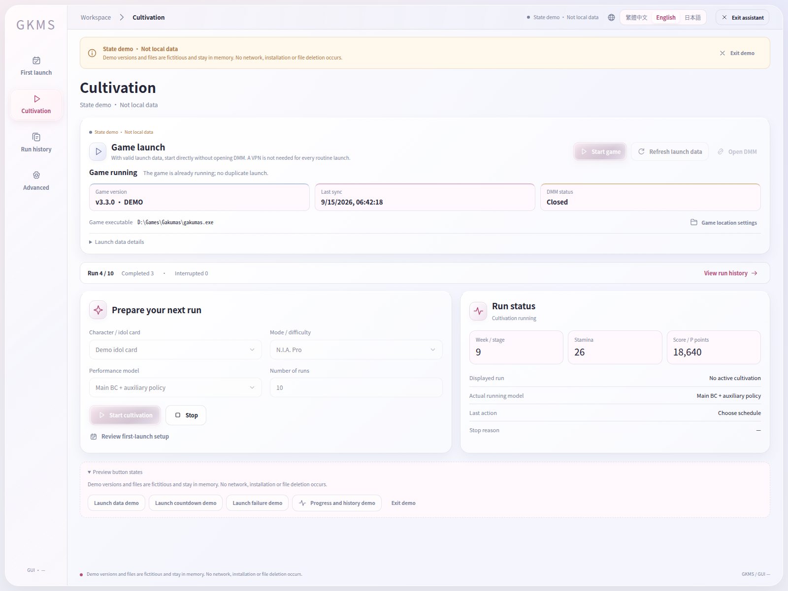
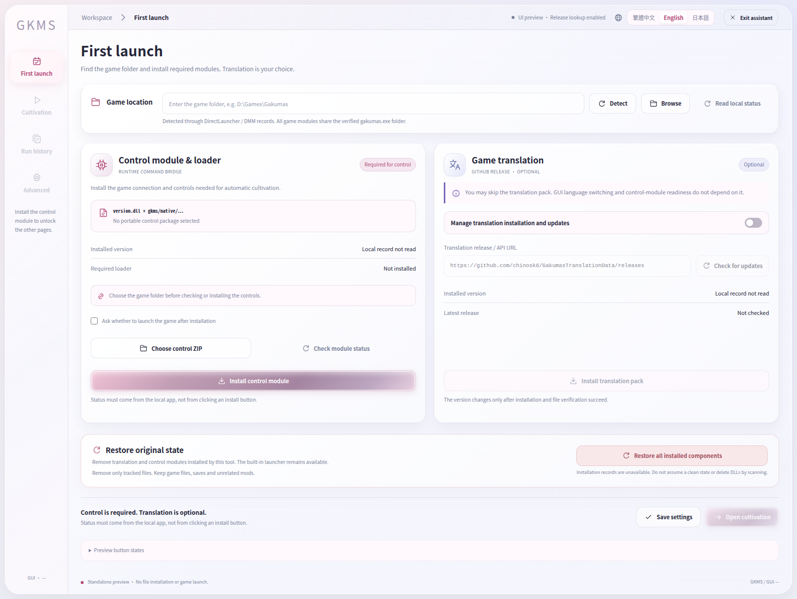

# GKMS Assistant

[繁體中文](README.md) · **English** · [日本語](README.ja.md)

A **Windows assistant for automated training runs** in Gakuen Idolmaster (学園アイドルマスター). Choose an idol, mode, and number of runs through a simple GUI, then let the model handle the run while you follow its progress.

**Current version: 0.1** · **[Download the latest release](https://github.com/fullpie/gkms-assistant/releases/latest)**

<!-- BEGIN GUI SCREENSHOTS -->
## GUI screenshots

Captured from the actual project frontend using its built-in offline demo, with the native game connector omitted. No game is connected; progress and scores shown are sample data, not measured results.

Setup and installation

<!-- END GUI SCREENSHOTS -->

## Features

- **Automated runs:** N.I.A. Pro / Master, idol selection, consecutive runs, and progress tracking.
- **Two policy options:** a primary behavior-cloning (BC) model with supporting strategies, or an integrated BC model.
- **Three interface languages:** Traditional Chinese, English, and Japanese, with required-module installation and optional game translation.

> Model training and primary offline validation currently focus on the Full Power (全力) playstyle in N.I.A. Pro / Master. Other selectable playstyles have not received equivalent training and validation.

## Getting started

**Requirements:** Windows x64, Microsoft Edge WebView2 Runtime, and .NET Framework 4.7.2 or later.

1. Download the full user package, `gkms-assistant-0.1.0-windows-x64.zip`, from [Releases](https://github.com/fullpie/gkms-assistant/releases/latest), not the GUI update or source archive.
2. Extract the entire archive and run `GKMS-Assistant.exe`.
3. Select the game folder in Settings and install the required control module before starting a run. Game translation is optional.

## Roadmap

- **Reinforcement learning (RL):** introduce RL training to improve decisions and scoring performance.
- **All-mode support:** gradually expand to every training mode and playstyle, with the corresponding strategies and validation.

These are development goals, not features already supported in 0.1.

## Development and licensing

[Development and packaging](docs/development.md) · [License notice](NOTICE.txt)

All rights reserved for original project portions; no additional open-source license is granted. Third-party components retain their respective licenses.
