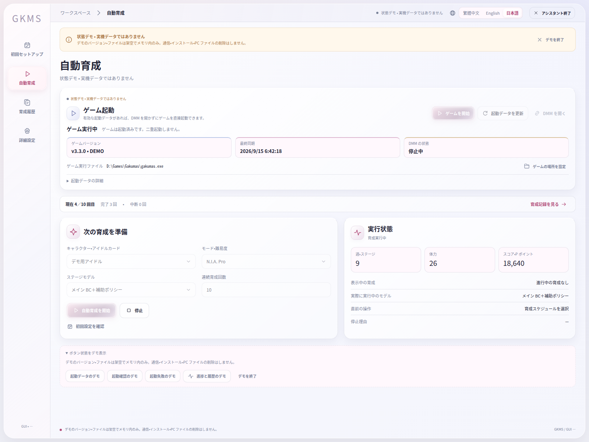
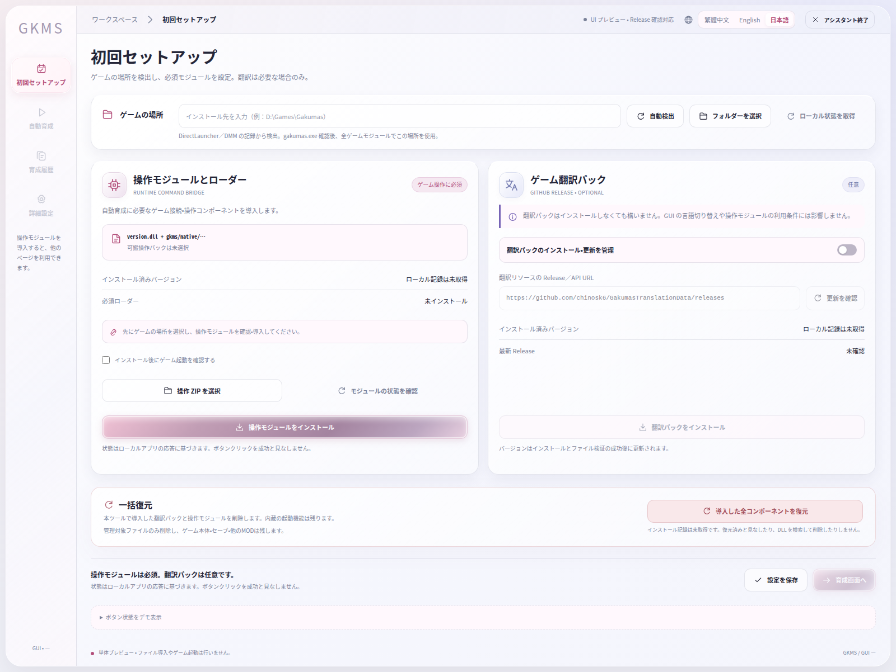

# GKMS Assistant 0.2.0

[繁體中文](README.md) · [English](README.en.md) · **日本語**

『学園アイドルマスター』PC 版の自動育成アシスタントです。共通の深層強化学習モデルが試験中のカード、ドリンク、付随する選択を判断し、既存の DLL がゲーム状態の取得と操作を行います。

<!-- BEGIN GUI SCREENSHOTS -->

画面の紹介

旧版のオフラインデモで撮影した画像です。表示値は実測結果ではありません。0.2 の試験モデルは共通 RL に変更されています。

<!-- END GUI SCREENSHOTS -->

## 主な機能

- アイドル選択から育成、試験、報酬受け取り、ホームへの復帰まで自動実行。
- モードと試験段階を入力条件とする、6 種類の育成タイプ共通のモデル。
- サポートカードとメモリーはゲームの推奨編成・既存ルールを使用し、指定カードを固定可能。
- 使用モデル、進行状況、停止理由、未校正の予測スコアを表示。
- ゲーム起動、任意の翻訳、操作モジュールの導入、GUI 更新を統合。

モデルの対象は N.I.A. Pro／Master です。モード・育成タイプごとに実機検証の範囲が異なり、一部の付随選択は学習データが不足しています。旧 BC モデルを安定して上回ることは確認されておらず、クリアや高得点を保証しません。週ごとの育成行動は既存の戦略を使用します。実行中にモデルを学習・差し替えることはありません。旧 BC の選択は無効になっています。

## 使い方

1. [Releases](https://github.com/fullpie/gkms-assistant/releases) から Windows 用の完全版パッケージを取得し、すべて展開します。
2. `GKMS-Assistant.exe` を起動し、ゲームフォルダーを指定して必要な操作モジュールを導入します。
3. アイドル、モード、回数を選択し、編成を確認して開始します。

Windows x64、Microsoft Edge WebView2 Runtime、.NET Framework 4.7.2 以降が必要です。GUI は独立したウィンドウで通常権限により動作します。ゲームの保守操作では管理者権限を求める場合があります。EXE だけを移動せず、フォルダー全体を保持してください。更新後に起動できない場合は `恢復 GUI.cmd` を使用できます。

CPU 推論用の依存ライブラリを同梱しているため、Python や NVIDIA GPU の導入は不要です。個人用の研究機能、アカウント情報、学習リプレイ、テスト DLL、ネイティブシミュレーターによる個人用編成探索は公開版に含みません。

独自部分の権利は留保されています。第三者コンポーネントには各ライセンスが適用されます。開発者向け情報は[ビルド手順](docs/public-gui-packaging.md)を参照してください。
