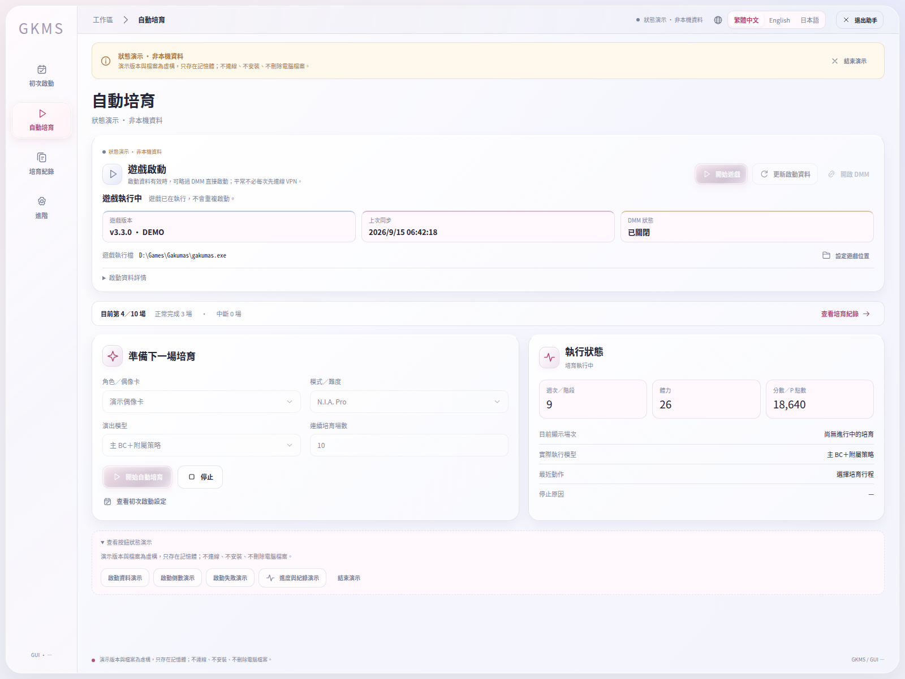
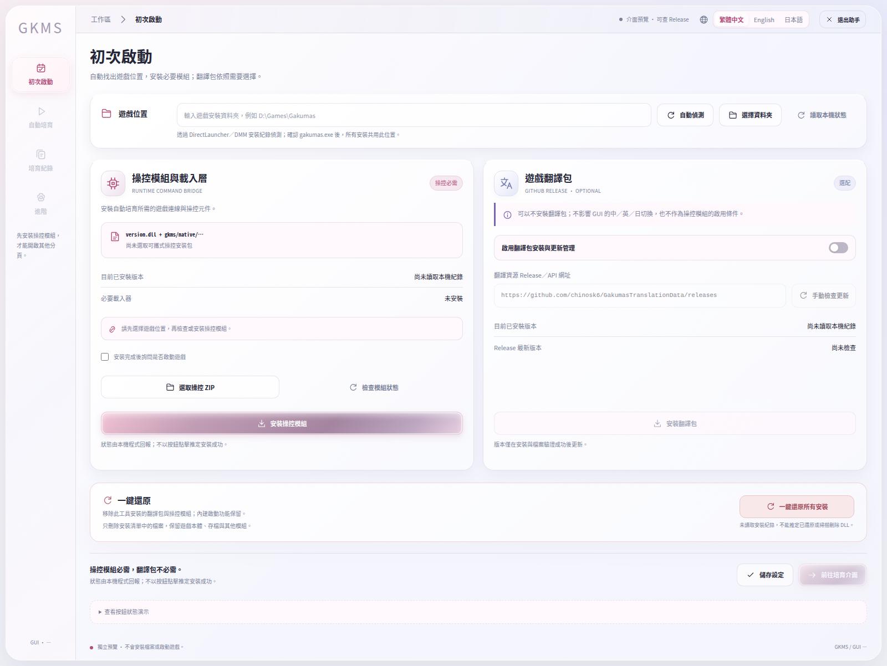

# GKMS Assistant

**繁體中文** · [English](README.en.md) · [日本語](README.ja.md)

《學園偶像大師》（学園アイドルマスター）的 **Windows 自動培育助手**。透過簡潔的 GUI 選擇偶像、模式與連續場數，使用模型執行培育並查看進度。

**目前版本：0.1** · **[下載最新版本](https://github.com/fullpie/gkms-assistant/releases/latest)**

<!-- BEGIN GUI SCREENSHOTS -->
## GUI 截圖

直接開啟本專案原始 GUI 前端，以內建離線示範模式擷取；未載入遊戲連接器，也未連接遊戲。畫面中的進度與分數為示範資料，不代表實測成績。

設定與安裝畫面

<!-- END GUI SCREENSHOTS -->

## 目前功能

- **自動培育**：N.I.A. Pro／Master、偶像選擇、連續場數與執行狀態。
- **策略切換**：「主 BC＋附屬策略」與「整合版 BC」兩種模型選擇。
- **三語介面**：繁體中文、英文、日文，整合必要模組安裝與可選的遊戲翻譯。

> 目前模型的訓練與主要離線驗證集中於「全力」N.I.A. Pro／Master；其他流派雖可選擇，尚未完成同等訓練與驗證。

## 開始使用

**需求：** Windows x64、Microsoft Edge WebView2 Runtime、.NET Framework 4.7.2 以上。

1. 前往 [Releases](https://github.com/fullpie/gkms-assistant/releases/latest)，下載完整使用者包 `gkms-assistant-0.1.0-windows-x64.zip`，不要選 GUI 更新包或原始碼包。
2. 完整解壓縮後，執行 `GKMS-Assistant.exe`。
3. 在設定中選擇遊戲資料夾並安裝必要的操控模組，再開始培育；遊戲翻譯可自行選擇是否安裝。

## 未來目標

- **強化學習（RL）**：導入 RL 訓練，改善培育決策與得分表現。
- **全模式支援**：逐步擴展至所有培育模式與流派，補齊各模式的策略與驗證。

以上為開發目標，不代表 0.1 已支援。

## 開發與授權

[開發與打包說明](docs/development.md) · [授權說明](NOTICE.txt)

原創部分保留所有權利，未額外授予開源授權；第三方元件維持各自授權。
