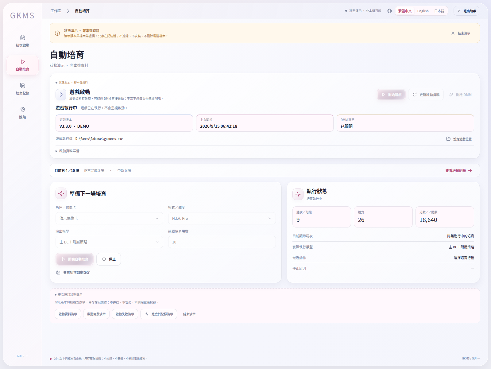
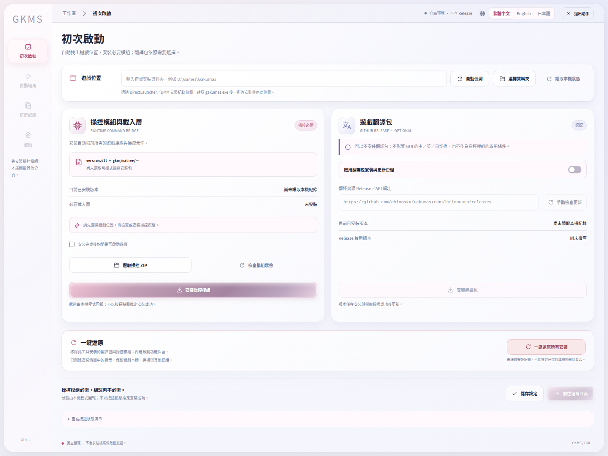

# GKMS Assistant 0.2.1

0.2.1 修正回憶候選誤篩：回憶來源流派不再被當成裝備限制，保留持有、鎖定及排除檢查。沿用原 RL_v1 權重，這項修正不代表推薦品質或分數已改善。

**繁體中文** · [English](README.en.md) · [日本語](README.ja.md)

學園偶像大師 PC 版的自動培育助手。以共用深度強化學習模型 **RL_v1** 推薦支援／回憶編成、選擇已支援的培育行動，以及決定演出出牌、飲料與附屬選擇。沿用原生 DLL 讀取狀態與執行操作。

<!-- BEGIN GUI SCREENSHOTS -->

介面示意

保留的舊版離線示範截圖，數值不是實測結果；0.2 的演出模型已改為共用 RL。

<!-- END GUI SCREENSHOTS -->

## 功能

- 自動完成選角、培育、演出、結算與回首頁。
- 同一份固定 RL_v1 權重涵蓋六種流派，以流派、模式及演出階段作為輸入。
- 從實際持有支援卡、回憶卡及當前可借卡中推薦編成，保留鎖定與排除設定。
- 顯示目前模型、執行進度與停止原因；整合遊戲啟動、翻譯及操作元件管理。
- 顯示演出預估分數；目前尚未校準，只作參考。
- 開啟時檢查助手更新，由使用者決定是否安裝。

模型範圍為 N.I.A. Pro／Master。RL_v1 已完成訓練與獨立資料評估，但沒有穩定優於 RL_v0 的結論；部分對局分數較低，飲料策略仍待改善。部分流派／模式的附屬決策資料不足，不保證通關或高分。模型不會在遊玩中自行訓練或換版，舊 BC 已停用選取。

遊戲資料更新本身不會阻止使用。助手會以已收錄的參考資料處理支援範圍內的卡牌與效果；若當次推論需要尚未收錄的新卡、飲料或效果定義，會明確指出缺項並停止。實際遊戲版本與參考資料版本分開記錄；遊戲程式或介面不相容時仍會停止，不會改用零值或規則冒充模型推論。

## 使用

1. 從 [Releases](https://github.com/fullpie/gkms-assistant/releases) 下載 Windows 版，完整解壓縮。
2. 執行 `GKMS-Assistant.exe`，依介面設定遊戲位置並安裝所需元件。
3. 選擇角色、模式與場數，確認編成後開始。

介面使用獨立 Windows 視窗，需要 Microsoft Edge WebView2 Runtime。首次啟動或維護遊戲可能要求系統管理員權限；助手平常以一般權限執行。更新後若無法開啟，可使用包內的「恢復 GUI.cmd」。請保留整個資料夾，勿單獨搬移 EXE。

## 範圍與資料

公開版只包含固定推論權重與必要的靜態資料，不包含訓練 checkpoint、optimizer、私人研究介面、訓練回放、帳號資料或測試 DLL。編成使用相同模型直接推論，不包含私人原生模擬搜尋。使用者不必安裝 Python 或具備 NVIDIA 顯示卡。

原創部分保留所有權利；第三方元件依各自授權提供。開發者建置資訊見 [公開版打包說明](docs/public-gui-packaging.md)。
